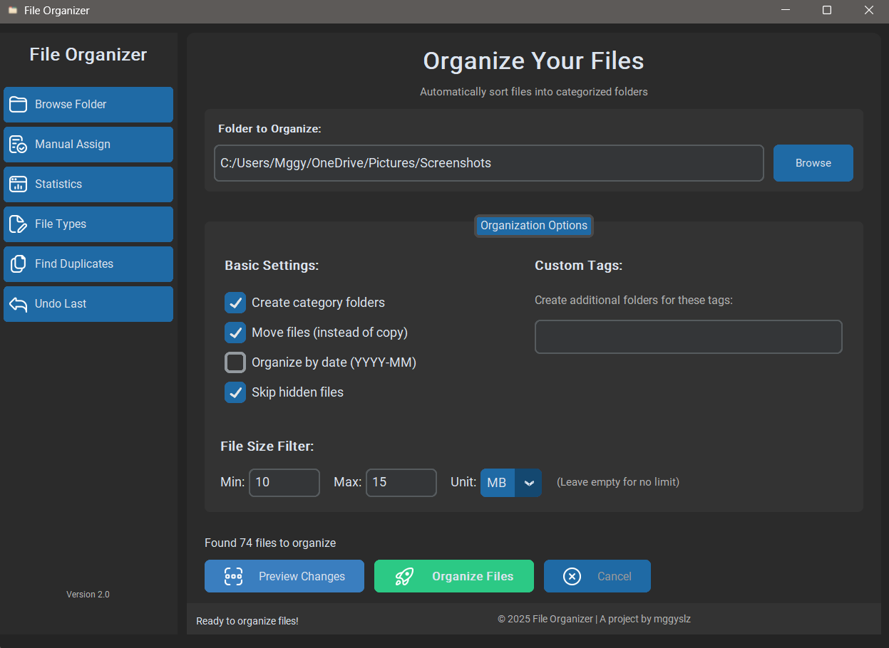

# **File Organizer Application**

File Organizer is a powerful cross-platform GUI application designed to help users automatically organize their files into categorized folders. With a user-friendly interface and advanced features, it simplifies file management by:

- Sorting files by type, date, or custom tags  
- Providing previews before organizing  
- Supporting manual file assignments  
- Detecting and managing duplicate files  
- Offering undo functionality  

Built with Python and CustomTkinter, the app provides a modern UI and leverages multi-threading for performance and secure file operations.

---

## **Screenshots**
  
*Main interface*

---

## **Features**

### Core Functionality

- **Automatic Organization**: Sort files into categories based on file extensions  
- **Custom Categories**: Define your own file type categories and extensions  
- **Date-Based Sorting**: Organize files by modification date (YYYY-MM)  
- **Size Filtering**: Process only files within specific size ranges  
- **Manual Assignments**: Override automatic categorization for specific files  

###  Advanced Features

- **Duplicate Detection**: Find and manage duplicate files using content-based comparison  
- **Undo Operations**: Revert recent file organization actions  
- **Folder Statistics**: View detailed insights about folder contents  
- **Multi-threaded Processing**: Efficiently handle large folders without freezing  
- **Secure Deletion**: Securely delete duplicate or unwanted files  

###  User Interface

- **Modern Dark Theme**: Sleek and intuitive interface  
- **Preview Mode**: Visualize organization changes before applying  
- **Responsive Design**: Optimized for various screen sizes  
- **Progress Tracking**: Visual indicators for operations in progress  

---

## **Installation**

### Prerequisites

- Python 3.8 or higher  
- `pip` package manager  

### Step-by-Step Setup

```bash
# 1. Clone the repository
git clone https://github.com/yourusername/file-organizer.git
cd file-organizer

# 2. (Optional but recommended) Create a virtual environment
python -m venv venv
# On Windows:
venv\Scripts\activate
# On macOS/Linux:
source venv/bin/activate

# 3. Install dependencies
pip install -r requirements.txt

# 4. Run the app
python core/main.py
```

---

## **Build as Executable (Windows)**

For end-users, a `.bat` file is already included to simplify the build process.

### Step-by-step:

```bash
# 1. Install PyInstaller
pip install pyinstaller
```

```bat
:: 2. Run build.bat
@echo off
rmdir /s /q build
rmdir /s /q dist
del /q *.spec
pyinstaller --onefile --windowed ^
--name FileOrganizerApp ^
--icon=assets/app_logo.ico ^
--add-data "assets;assets" ^
--add-data "file_organizer_config.json;." ^
core/main.py
pause
```

- The executable will be located inside the **`dist/`** folder.

---

## **Usage**

### Basic Steps

1. Select the folder you want to organize  
2. Choose your organization options:
   - Category folders  
   - Move or copy files  
   - Organize by date  
3. Click **"Preview Changes"**  
4. Click **"Organize Files"**  

### Advanced Usage

- **Custom Tags**: Add comma-separated tags to create custom categories  
- **Size Filtering**: Define minimum and maximum file sizes to include  
- **Manual Assignments**: Manually assign files to categories  
- **Duplicate Detection**: Use the duplicate scan to identify and manage duplicates  

---

## **Configuration**

All settings are stored in `file_organizer_config.json`.  

You can:
- Modify categories using the "Edit File Types" UI  
- Adjust behaviors in the "Options" tab  
- Reset all preferences by deleting the config file  

---

## **Project Structure**

```
file-organizer/
├── assets/                      # Icons and images
│   └── screenshots/             # App screenshots
├── core/
│   ├── file_operations.py       # Core file handling logic
│   └── config_manager.py        # Settings and config
├── features/
│   ├── smart_features.py        # AI & smart logic
│   └── security_performance.py  # Secure deletes & performance
├── ui/
│   ├── ui_components.py         # UI layout
│   └── ui_enhancements.py       # Extra UI tools
├── main.py                      # App entry point
├── build.bat                    # Windows build script
└── requirements.txt             # Python dependencies
```

---

##  **Dependencies**

- `customtkinter` – modern UI widgets  
- `Pillow` – image handling  
- Python Standard Library modules  

---

## **Troubleshooting**

### Common Problems & Fixes

- **Permission Denied**
  - Ensure you have write access to the folder  
  - Try running as Administrator (Windows only)

- **Missing Packages**
  - Run: `pip install --force-reinstall -r requirements.txt`

- **App Freezes**
  - Large folders take time; use filters to limit files

- **Corrupted Settings**
  - Delete `file_organizer_config.json` to reset everything

---

## **Contributing**

We welcome pull requests!  
Here’s how you can help:

```bash
# 1. Fork the repository
# 2. Create a feature branch
git checkout -b feature/your-feature

# 3. Commit your changes
git commit -m "Add cool feature"

# 4. Push and open a PR
git push origin feature/your-feature
```

---

##  **Note**

> This application is actively maintained.  
> Expect regular updates, bug fixes, and new features!

---

**MIT License** | Made with ❤️ by [mggylsz]
